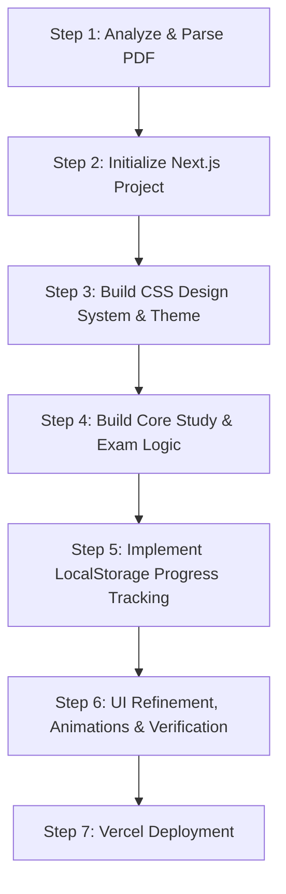

# Project Description: ULC PPLA Exam Prep App

A modern, high-fidelity web application to help aspiring pilots study for and pass the **Private Pilot License - Aeroplane (PPLA)** exam administered by the Polish **Civil Aviation Authority (Urząd Lotnictwa Cywilnego - ULC)**. The app will be built using the questions parsed from `ppla.pdf` and deployed to Vercel.

---

## 🎯 Project Goals
1. **Automated PDF Parsing**: Extract questions, answers, multiple-choice options, and categories from `ppla.pdf` (Polish language) into a structured format.
2. **Premium Learning Interface**: A stunning, responsive UI that includes Study Mode, Exam Simulations, and progress tracking.
3. **Seamless Deployment**: Fully optimized for deployment on Vercel.
4. **Zero-Overhead Data Strategy**: Fast load times with zero database costs/maintenance by utilizing structured JSON static datasets + `localStorage` for progress tracking.

---

## 🛠️ Proposed Tech Stack

| Component | Technology | Rationale |
| :--- | :--- | :--- |
| **Framework** | **Next.js (React)** | Server-side rendering (SSR) / Static Site Generation (SSG) for instant loads, file-based routing, and built-in serverless functions for potential backend helpers. |
| **Styling** | **Custom Vanilla CSS (CSS Modules)** | Allows full control over custom pilot-themed animations, neon glassmorphism effects, and highly polished responsive layouts without Tailwind constraints. |
| **Data Storage** | **Static JSON + localStorage** | Since the official ULC question bank is static, extracting and packaging it as a structured JSON file guarantees 0ms database latency, 100% uptime, zero database hosting costs, and easy serverless deployment. User stats and history will persist in the browser's `localStorage`. |
| **Parsing Script** | **Node.js + `pdf-parse` (or custom Python/Node utility)** | A utility script to ingest `ppla.pdf`, tokenize the text, and output a clean JSON catalog of questions. |

---

## 📐 Application Architecture & Key Features

### 1. Data Extractor Utility (`/scripts/parse-pdf.js`)
* Ingests `ppla.pdf`.
* Cleans up Polish character formatting and separates content into:
  * **Category** (e.g., *Prawo lotnicze*, *Człowiek - możliwości i ograniczenia*, *Meteorologia*, *Nawigacja*, etc.).
  * **Question Text**.
  * **Answer Options** (A, B, C, D).
  * **Correct Answer Key**.
* Outputs `public/data/questions.json`.

### 2. User Experience (UX) & Modes
* **Dashboard / Flight Deck**: Overview of study progress, average scores across categories, and a quick-start interface.
* **Study Mode (Trening)**:
  * Categorized study (focus on specific subjects).
  * Immediate feedback showing correct/incorrect answers with explanations.
  * Option to bookmark tricky questions.
* **Exam Simulation (Symulacja Egzaminu)**:
  * Emulates the official ULC exam constraints (time limits, specific number of questions per category).
  * No immediate feedback (answers shown only at the end).
  * Detailed review page showing correct answers for missed questions.
* **Statistics & Progress (Dziennik Pokładowy)**:
  * Visual charts representing score trends and category mastery.
  * List of weak areas that need more attention.

### 3. Aesthetics & Design System
* **Theme**: "Cockpit Dark" — a sleek, dark flight-instrument-inspired interface. Uses deep obsidian/navy backgrounds (`#0B0F19`), subtle aircraft instrumental green/amber accents, and crisp typography (e.g., *Inter* or *Outfit* from Google Fonts).
* **Vibe**: Glassmorphic cards, smooth page transitions, micro-animations when selecting answers, and responsive typography.

---

## 🚀 Step-by-Step Implementation Roadmap

### Phase 1: Data Preparation
* [ ] Inspect the layout and structure of `ppla.pdf` (e.g., search patterns for question numbers, options, correct answers).
* [ ] Create and run the parsing script to generate `questions.json`.
* [ ] Verify data completeness and correctness (check for missing characters or misaligned answers).

### Phase 2: Core Development
* [ ] Initialize Next.js app in the project directory.
* [ ] Create the core CSS theme with colors, variables, and animations.
* [ ] Build the layout, navbar, and landing dashboard.
* [ ] Implement the study engine and question-rendering components.
* [ ] Implement the exam simulator and score calculator.

### Phase 3: Polish & Launch
* [ ] Refine micro-interactions (hover, selection animations).
* [ ] Set up SEO metadata.
* [ ] Verify responsiveness on mobile, tablet, and desktop screens.
* [ ] Deploy to Vercel.
